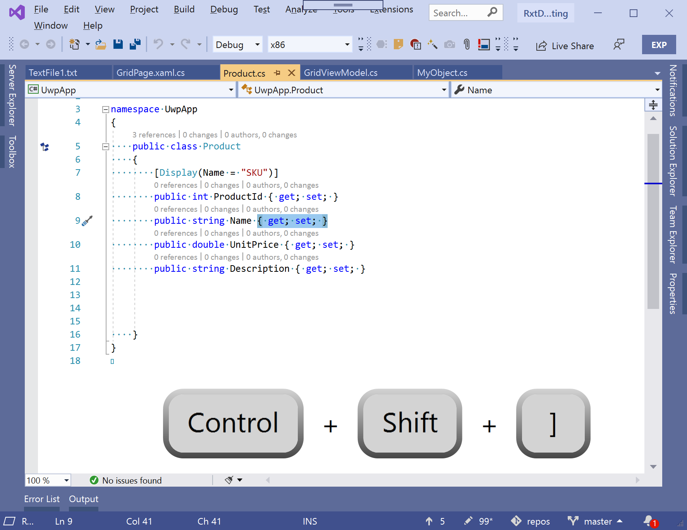
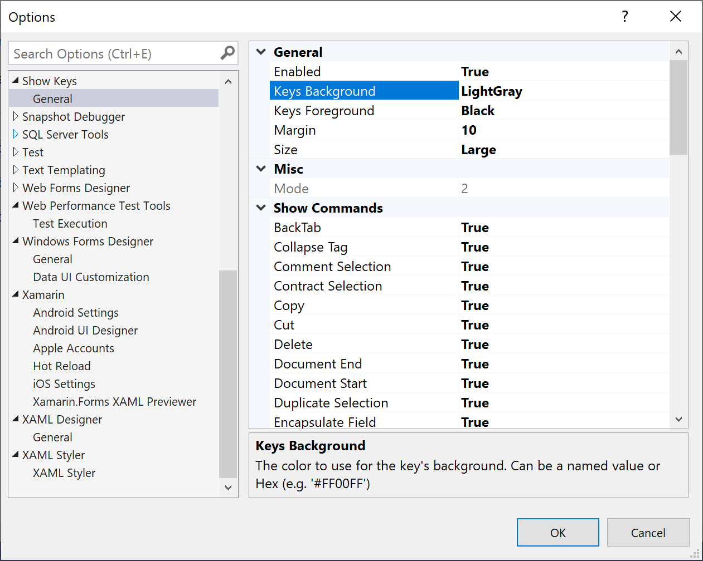

# ShowKeys

Show the default keyboard shortcuts on screen when common commands are invoked.

Intended for use during code demos or presentations to help the audience see what you're typing.

Works with

- Back Tab (Shift+Tab)
- Collapse Tag (Ctrl+M, Ctrl+T)
- Collapse Outline To Definitions (Ctrl+M, Ctrl+O)
- Comment Selection (Ctrl+K, Ctrl+C)
- Contract Selection (Shift+Alt+-)
- Copy (Ctrl+C)
- Cut (Ctrl+X)
- Delete (Delete)
- Document End (Ctrl+End)
- Document Start (Ctrl+Home)
- Duplicate Selection (Ctrl+D)
- Encapsulate Field (Ctrl+R, Ctrl+E)
- Escape (Escape)
- Execute In Interactive (Alt+Enter)
- Expand Selection (Shift+Alt+=)
- Extend Selection to Line End (Shift+End)
- Extend Selection to Line Start (Shift+Home)
- Extend to Brace (Ctrl+Shift+])
- Find All References (Shift+F12)
- Format Document (Ctrl+K, Ctrl+D)
- Format Selection (Ctrl+K, Ctrl+F)
- Go to Brace (Ctrl+])
- Go To Definition (F12)
- Help (F1)
- Hide Outline Selection (Ctrl+M, Ctrl+H)
- Invoke Quick Info (Ctrl+K, Ctrl+I)
- Insert All Matching Carets (Shift+Alt+;)
- Insert Next Matching Caret (Shift+Alt+.)
- Left (Left Arrow)
- Line End (End)
- Line Start (Home)
- Move Selected Lines Down (Alt+Down Arrow)
- Move Selected Lines Up (Alt+Up Arrow)
- Navigate To Next Highlighted Reference (Ctrl+Shift+Down Arrow)
- Navigate To Next Issue In Document (Alt+PgDn)
- Navigate To Previous Highlighted Reference (Ctrl+Shift+Up Arrow)
- Navigate To Previous Issue In Document (Alt+PgUp)
- Open Line Above (Ctrl+Enter)
- Open Line Below (Ctrl+Shift+Enter)
- Page Down (PgDown)
- Page Up (PgUp)
- Paste (Ctrl+V)
- Redo (Ctrl+Y)
- Remove Parameters (Ctrl+R, Ctrl+V)
- Rename (Ctrl+R, Ctrl+R)
- Reorder Parameters (Ctrl+R, Ctrl+O)
- Return (Enter)
- Right (Right Arrow)
- Save (Ctrl+S)
- Select All (Ctrl+A)
- Show Navigate Menu (Alt+`)
- Stop Hiding Current Outlining (Ctrl+M, Ctrl+U)
- Tab (Tab)
- Toggle All Outlining (Ctrl+M, Ctrl+L)
- Toggle Completion Mode (Ctrl+Alt+Space)
- Uncomment Selection (Ctrl+K, Ctrl+U)
- Undo (Ctrl+Z)
- View Call Hierarchy (Ctrl+K, Ctrl+T)
- View Code (F7)
- View Form Designer (Shift+F7)
- Word Delete To End (Ctrl+Delete)
- Word Delete To Start (Ctrl+Backspace)

For a list of all default shortcuts in Visual Studio see the list on [docs.microsoft.com](https://docs.microsoft.com/en-us/visualstudio/ide/default-keyboard-shortcuts-in-visual-studio?view=vs-2019).

## Lots of configurable options

## FAQs

**Why are so few commands supported?**
Only those commands that are exposed via by Visual Studio to the extensibility model are shown. Sorry.

**Why are the default shortcuts shown rather than what was pressed?**
The purpose of displaying the keys is to help anyone viewing to understand what you did. By showing the default shortcut combinations it is hoped that this will enable others to also use the shortcuts.

**Why are some commands only shown for some file types?**
This is a limitation of Visual Studio extensibility. If you have specific examples of commands that don't work for specific file types, please raise an issue and I'll investigate if it's possible to do anything about it.
